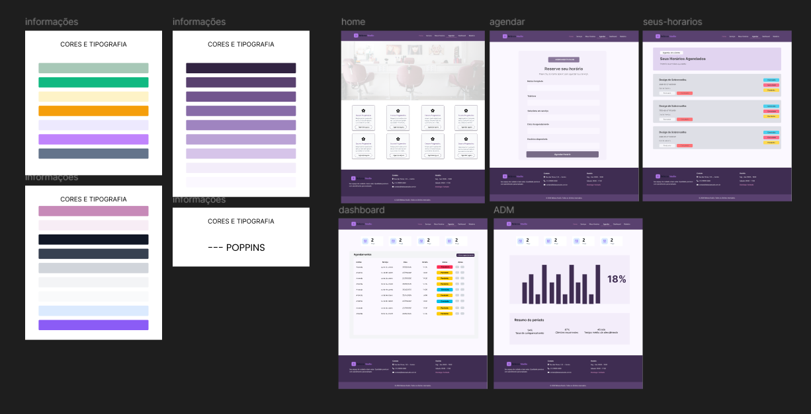
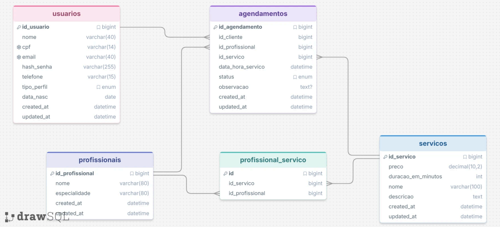

# 💅✨💇‍♀️ Belezza Studio 💇‍♀️✨💅

Projeto acadêmico desenvolvido no **segundo módulo** do curso de Engenharia de Software.

---

## 📖 Sobre o Projeto

O **Belezza Studio** é um sistema web para gerenciamento de um salão de beleza. As páginas consomem e exibem os dados do banco de forma dinâmica, e o sistema oferece **três CRUDs completos** — Serviços, Usuários e Agendamentos — com cadastro, edição e exclusão feitos pela própria interface e com as regras de negócio validadas no servidor.

O acesso é dividido em **três níveis**:

| Nível                   | O que enxerga                                                                          |
| ----------------------- | -------------------------------------------------------------------------------------- |
| **Público** (sem login) | Home com o catálogo de serviços, login e cadastro de conta                              |
| **Cliente logado**      | Agendamento e "Seus horários"                                                            |
| **Administrador**       | Dashboard, relatório, os três CRUDs e o cadastro de profissionais                       |

Nas páginas públicas há ainda um **assistente virtual** — um agente de IA do Botpress que responde sobre serviços, preços, horários e como agendar, a partir de uma base de conhecimento própria.

---

## 🖥️ Demonstração

[Acessar o Figma](https://www.figma.com/design/JVJyAJ1bdYh6oRQKnPj9nM/BelezzaStudio?node-id=0-1&t=2cHLFckRdHt7PBO8-1)


---

## 🚀 Funcionalidades

- 👤 **CRUD de usuários** — cadastro público de clientes, edição e exclusão pelo admin, com senha em `password_hash` e CPF/e-mail únicos
- 🔐 **Login pelo banco** com `password_verify`, sessão por perfil e retorno para a página pretendida (`?destino=`)
- 🛡️ **Guarda de acesso rota a rota** — `exigirLogin()`, `exigirAdmin()` e `exigirAdminNaApi()`, esta devolvendo `403` em JSON
- 💇 **CRUD de serviços** — nome, descrição, preço e duração, com bloqueio de nome duplicado e de exclusão quando há agendamento vinculado
- 📅 **CRUD de agendamentos** — cadastro, edição e exclusão com status `pendente`, `confirmado`, `cancelado` e `concluido`
- 📊 **Dashboard** com indicadores, ranking de serviços, paginação e filtro por status, alimentada por uma API JSON
- 📈 **Relatório** com gráficos dinâmicos em **Chart.js** sobre dados reais e exportação em PDF via **html2pdf.js**
- 🧮 **Lógica no banco** — view, procedures, function e triggers de validação
- 🎨 Layout responsivo com **Bootstrap 5**, tema claro/escuro e formulários validados com Parsley + Inputmask
- 🔔 Mensagens de retorno e confirmações de exclusão em **SweetAlert2**, centralizadas em `mensagensDeRetorno()`
- 🧩 Front-end em **TypeScript** no modo `strict`, compilado para `public/assets/js/`
- 🤖 **Assistente virtual** no canto das páginas públicas, um agente do **Botpress** que responde sobre serviços, preços, horários e como agendar

---

## 🛠 Tecnologias Utilizadas

| Tecnologia              | Descrição                                                              |
| ----------------------- | ---------------------------------------------------------------------- |
| **PHP 8**               | Roteamento, views e regras de negócio; acesso ao banco por PDO          |
| **MariaDB**             | Banco relacional, com view, procedures, function e triggers             |
| **TypeScript**          | Lógica de front-end (`src/`), compilada pelo `tsc`                      |
| **HTML5 / CSS3**        | Estrutura e estilos: um CSS por página, mais `global.css` e `admin.css` |
| **Bootstrap 5.3.8**     | Layout e componentes da interface                                       |
| **Chart.js**            | Gráficos do relatório                                                   |
| **html2pdf.js**         | Exportação do relatório em PDF                                          |
| **Parsley + Inputmask** | Validação e máscaras de formulário                                      |
| **SweetAlert2**         | Mensagens de retorno e confirmação antes de excluir                     |
| **Phosphor Icons**      | Ícones da interface                                                     |
| **Botpress**            | Agente de IA do assistente virtual, embutido pelo webchat                |

> As bibliotecas de front-end são carregadas por **CDN** — não é preciso instalar nada além do TypeScript.

---

## 🗄️ Banco de Dados

### 📐 Diagrama de Entidade-Relacionamento (DER)

> 

### 📋 Tabelas

| Tabela                 | Descrição                                                    |
| ---------------------- | ------------------------------------------------------------ |
| `usuarios`             | Clientes e administradores do sistema                        |
| `profissionais`        | Profissionais do salão e suas especialidades                 |
| `servicos`             | Serviços oferecidos com preço e duração                      |
| `agendamentos`         | Registro de agendamentos por cliente, profissional e serviço |
| `profissional_servico` | Relacionamento N:N entre profissionais e serviços            |

### 🔗 Relacionamentos

- `agendamentos.id_cliente` → `usuarios.id_usuario`
- `agendamentos.id_profissional` → `profissionais.id_profissional`
- `agendamentos.id_servico` → `servicos.id_servico`
- `profissional_servico.id_profissional` → `profissionais.id_profissional` _(N:N)_
- `profissional_servico.id_servico` → `servicos.id_servico` _(N:N)_

> As chaves estrangeiras são **RESTRICT**: um serviço ou usuário com agendamento vinculado não pode ser excluído — e a interface bloqueia o botão antes mesmo de tentar, explicando o motivo.

### ⚙️ Objetos de lógica no banco

| Objeto                                              | Tipo      | Para que serve                                            |
| --------------------------------------------------- | --------- | --------------------------------------------------------- |
| `vw_agendamentos_completos`                         | View      | Junta agendamento, cliente, profissional e serviço         |
| `func_receita_agendamento`                          | Function  | Receita de um agendamento (0 quando não está `concluido`)  |
| `sp_dashboard_indicadores`                          | Procedure | Números dos cards da dashboard                             |
| `sp_dashboard_listar_agendamentos`                  | Procedure | Listagem paginada com filtro por status                    |
| `sp_dashboard_contar_agendamentos`                  | Procedure | Total de registros, para a paginação                       |
| `sp_ranking_servicos`                               | Procedure | Ranking dos serviços mais agendados                        |
| `trg_servicos_valores_positivos_insert` / `_update` | Triggers  | Impedem preço ou duração negativos                         |

---

## ▶️ Como Executar

### Pré-requisitos

- **XAMPP** (Apache + MariaDB)
- **Node.js** — apenas para compilar o TypeScript

### 1. Clonar o repositório

```bash
git clone https://github.com/AmandaSoaresV/belezza-studio.git
```

Coloque o projeto em `C:\xampp\htdocs\belezzaStudio`.

### 2. Configurar o VirtualHost

A aplicação roda em **`http://belezzastudio.local:8080`**, com o `DocumentRoot` apontando para a pasta **`public/`** — e não para a raiz do projeto.

Em `C:\xampp\apache\conf\extra\httpd-vhosts.conf`:

```apache
Listen 8080

<VirtualHost *:8080>
    ServerName belezzastudio.local
    DocumentRoot "C:/xampp/htdocs/belezzaStudio/public"

    <Directory "C:/xampp/htdocs/belezzaStudio/public">
        Options -Indexes +FollowSymLinks
        AllowOverride All
        Require all granted
    </Directory>
</VirtualHost>
```

E em `C:\Windows\System32\drivers\etc\hosts`, editado como administrador:

```
127.0.0.1    belezzastudio.local
```

> ⚠️ **Não é a porta 80.** Abrir por `localhost` ou sem a porta resulta em "conexão recusada".
>
> O `Options -Indexes` desabilita a listagem de diretórios, e o `AllowOverride All` é necessário para o `.htaccess` de `public/` reescrever as URLs amigáveis.

### 3. Iniciar os serviços

Abra o **XAMPP Control Panel** e inicie o **Apache** e o **MySQL**.

> ⚠️ O **MariaDB do XAMPP usa a porta 3307 e não sobe sozinho** — é preciso iniciá-lo pelo painel a cada vez.
>
> Se a máquina também tiver um serviço `MySQL84` (Oracle MySQL) na porta 3306, ele **não** é o banco do projeto: ver um `mysqld` em execução não significa que o MariaDB está no ar. Confirme que a 3307 está escutando:

```bash
netstat -ano | findstr :3307
```

### 4. Importar o banco de dados

Crie o banco `belezza_studio` e importe os arquivos de `banco/` **nesta ordem**:

```
schema.sql → inserts.sql → functions.sql → views.sql → procedures.sql → triggers.sql
```

> ⚠️ A ordem é obrigatória: `views.sql` chama `func_receita_agendamento`, então a function precisa existir antes.

Pelo phpMyAdmin (`http://localhost/phpmyadmin`), importe um arquivo por vez nessa sequência. Ou pela linha de comando:

```bash
cd C:\xampp\mysql\bin
mysql -u root -P 3307 -e "CREATE DATABASE belezza_studio CHARACTER SET utf8mb4"
mysql -u root -P 3307 belezza_studio < C:\xampp\htdocs\belezzaStudio\banco\schema.sql
mysql -u root -P 3307 belezza_studio < C:\xampp\htdocs\belezzaStudio\banco\inserts.sql
mysql -u root -P 3307 belezza_studio < C:\xampp\htdocs\belezzaStudio\banco\functions.sql
mysql -u root -P 3307 belezza_studio < C:\xampp\htdocs\belezzaStudio\banco\views.sql
mysql -u root -P 3307 belezza_studio < C:\xampp\htdocs\belezzaStudio\banco\procedures.sql
mysql -u root -P 3307 belezza_studio < C:\xampp\htdocs\belezzaStudio\banco\triggers.sql
```

O arquivo `banco/ctes.sql` é uma consulta de estudo com CTEs e **não** faz parte do import.

### 5. Configurar a conexão

Copie `api/conexao.exemplo.php` para `api/conexao.php` e ajuste as credenciais:

```php
$host = "localhost";
$db   = "belezza_studio";
$user = "root";
$pass = "";
$port = 3307;
```

> O `api/conexao.php` está no `.gitignore` por conter credenciais. Alterações de conexão vão no `conexao.exemplo.php`.

### 6. Compilar o TypeScript

```bash
npm install
npm run build
```

O `tsc` compila `src/*.ts` para `public/assets/js/`, gerando `app.js`, `relatorio.js`, `agente.js` e `types.js`. **Nunca edite esses quatro à mão** — são sobrescritos no próximo build. Os demais arquivos dessa pasta (`alertas.js`, `formularios.js`, `agendamento.js`, `tema.js`) são escritos à mão e o `tsc` não os toca.

### 7. Acessar

```
http://belezzastudio.local:8080
```

> 💡 Ao testar alterações de JavaScript, recarregue com **Ctrl + Shift + R**: o navegador serve o `.js` do cache e continua mostrando a versão antiga.

---

## 🔄 Fluxo do dado

Como um número sai do banco e chega até a tela, usando a dashboard como exemplo:

```
MariaDB (tabelas)
  └─ vw_agendamentos_completos · sp_dashboard_* · func_receita_agendamento
       └─ includes/analytics.php        helpers PHP que chamam as procedures e convertem tipos
            ├─ app/views/dashboard/…    renderiza o HTML já com os dados
            └─ api/dashboard.php        devolve o mesmo dado em JSON
                 └─ src/app.ts · src/relatorio.ts   busca, processa e desenha
                      └─ public/assets/js/*.js      gerado pelo tsc, é o que o navegador carrega
```

1. **O banco calcula.** A receita não é somada no PHP: `func_receita_agendamento` devolve o valor do serviço apenas quando o agendamento está `concluido`, e a view expõe isso como uma coluna pronta.
2. **O PHP consulta pelos helpers.** As views não escrevem SQL cru — chamam funções de `includes/analytics.php`, que executam as procedures com prepared statements e convertem os tipos explicitamente (`(int)`, `(float)`, `?? 0`).
3. **A API serializa.** `api/dashboard.php` devolve `indicadores`, `ranking`, `agendamentos` e `paginacao` em JSON, dentro de um `try/catch (PDOException)` que responde `500` com mensagem genérica — erros nunca expõem detalhes do banco.
4. **O TypeScript processa.** `src/app.ts` busca os dados, agrupa os status num objeto chave-valor, soma o faturamento com `reduce` e monta o HTML com `map`. `src/relatorio.ts` agrupa os agendamentos por mês (`YYYY-MM`) para o gráfico de linha e usa o ranking real no donut.
5. **O navegador só recebe o resultado.** Os arquivos de `public/assets/js/` são artefatos do `tsc`.

A escrita segue o caminho inverso: o `POST` é tratado **no topo da própria view**, com prepared statements, e a página redireciona para si mesma com um parâmetro de mensagem — que `mensagensDeRetorno()` (em `includes/app.php`) traduz e a parcial `includes/alertas.php` entrega ao SweetAlert2, serializada com `json_encode` para não quebrar dentro do `<script>`.

---

## 🤖 Assistente virtual

O chat que aparece no canto das páginas públicas é um agente de IA hospedado no **Botpress**. O site não processa nenhuma pergunta: ele apenas embute o webchat e aplica a identidade visual do projeto por cima.

### O que fica onde

| Onde | O quê |
| ---- | ----- |
| Console do Botpress | O agente em si — modelo, base de conhecimento indexada e os atalhos de conversa |
| `docs/instrucoes-agente.md` | O texto colado no campo de **instruções** do bot: persona, tom de voz, o que ele não responde |
| `docs/base-conhecimento-agente.md` | O texto colado na **base de conhecimento**: serviços, preços, duração, horários, endereço e o passo a passo do agendamento |
| `includes/agente.php` | As duas tags `<script>` do webchat, mais o nosso `agente.js` |
| `src/agente.ts` | Cor, tema, avatar e textos de boas-vindas, além da injeção do CSS |
| `public/assets/css/agente.css` | Aparência do botão flutuante |

O agente responde **exclusivamente** a partir da base de conhecimento e é instruído a nunca inventar preço, horário ou disponibilidade. Ele também não agenda: orienta a cliente a usar a página de agendamento ou a ligar para o salão.

### Como o site personaliza o webchat

O Botpress monta o widget dentro de um **shadow root**, então uma folha de estilo comum no `header.php` não alcança o botão. Por isso `src/agente.ts` espera o `#fab-root` ganhar o shadow root e então, de uma vez só:

1. injeta ali dentro um `<link>` para `public/assets/css/agente.css`;
2. chama `window.botpress.config()`, que **mescla** com a configuração vinda do console — os atalhos de conversa definidos lá continuam valendo.

As cores não são redefinidas: o CSS usa `--primary-700`, `--primary-800` e `--pink-500` do `global.css`, e o TypeScript lê `--primary-600` com `getComputedStyle` para tingir o interior do chat. O tema do chat acompanha a classe `tema-claro` do `body`.

### Trocar de bot

As URLs do webchat ficam em `includes/agente.php` e saem de **Webchat → Share** no console do Botpress:

```php
$injetorAgente = 'https://cdn.botpress.cloud/webchat/v5.0/inject.js';
$configAgente  = 'https://files.bpcontent.cloud/.../config.js';
```

São públicas por natureza — o navegador de qualquer visitante as carrega —, por isso ficam versionadas. Deixar `$configAgente` em branco desliga o assistente sem quebrar nenhuma página.

O widget é incluído por `includes/footer.php`, então aparece nas páginas públicas (início, login, cadastro, agendamento e "Seus horários") e **não** nas telas do admin, que usam `includes/admin-footer.php`.

---

## 🗺️ Rotas

Tudo passa por `public/index.php`, um `switch` sobre `?page=`. O `.htaccess` de `public/` reescreve as URLs amigáveis para esse parâmetro.

| Rota                       | Acesso  | Descrição                                |
| -------------------------- | ------- | ---------------------------------------- |
| `/`                        | Público | Home com o catálogo de serviços          |
| `/login` · `/logout`       | Público | Entrada e saída da sessão                |
| `/usuarios/cadastrar`      | Público | Criação de conta de cliente              |
| `/agendamento`             | Cliente | Novo agendamento                         |
| `/seushorarios`            | Cliente | Agendamentos do usuário logado           |
| `/dashboard`               | Admin   | Indicadores, ranking e agendamentos      |
| `/relatorio`               | Admin   | Gráficos e exportação em PDF             |
| `/servicos*`               | Admin   | CRUD de serviços                         |
| `/usuarios*`               | Admin   | Listagem, edição e exclusão de usuários  |
| `/agendamentos/*`          | Admin   | Cadastro e edição de agendamentos        |
| `/profissionais/cadastrar` | Admin   | Cadastro de profissionais                |
| `/api/dashboard`           | Admin   | JSON da dashboard e do relatório         |
| `/api/servico`             | Público | JSON dos serviços exibidos na home       |
| `/api/agendamento`         | Admin   | JSON dos agendamentos                    |

---

## 📂 Estrutura do Projeto

```bash
.
├── api/                          # endpoints que respondem JSON puro
│   ├── agendamento.php
│   ├── conexao.exemplo.php       # modelo da conexão (o conexao.php é ignorado pelo git)
│   ├── dashboard.php
│   └── servico.php
├── app/
│   └── views/                    # uma pasta por recurso; cada view é um documento completo
│       ├── agendamento/          agendamentos/   dashboard/   erro/   index/
│       ├── login/                profissionais/  relatorio/   seushorarios/
│       ├── servicos/             # index (listagem) + cadastrar + editar
│       └── usuarios/             # index (listagem) + cadastrar + editar
├── banco/                        # a lógica de consulta vive aqui
│   ├── schema.sql   inserts.sql     functions.sql
│   ├── views.sql    procedures.sql  triggers.sql
│   └── ctes.sql                  # consulta de estudo, fora do import
├── docs/                         # instruções e base de conhecimento do agente do Botpress
│   └── instrucoes-agente.md   base-conhecimento-agente.md
├── includes/                     # parciais e helpers compartilhados
│   ├── header.php  sidebar.php  footer.php  admin-head.php  admin-footer.php
│   ├── alertas.php  form-validacao-head.php  form-validacao-foot.php
│   ├── agente.php                # scripts do webchat do Botpress
│   ├── analytics.php             # helpers de consulta ao banco
│   ├── app.php                   # helpers gerais e mensagensDeRetorno()
│   └── sessao.php                # login, perfis e guardas de acesso
├── src/                          # TypeScript (strict, escopo global)
│   └── app.ts   relatorio.ts   agente.ts   types.ts
├── public/                       # DocumentRoot do VirtualHost
│   ├── index.php                 # roteador
│   ├── .htaccess                 # URLs amigáveis
│   └── assets/
│       ├── css/                  # um arquivo por página + global.css e admin.css
│       ├── img/
│       └── js/
│           ├── app.js  relatorio.js  agente.js  types.js   # GERADOS pelo tsc, não editar
│           └── alertas.js  formularios.js  agendamento.js  tema.js   # escritos à mão
├── package.json                  # npm run build
├── tsconfig.json
├── LICENSE
└── README.md
```

---

## 👩‍💻 Desenvolvedora

| [Amanda Soares Vieira](https://github.com/amandasoaresv) |
| -------------------------------------------------------- |

---

## Licença

Este projeto está sob a **licença MIT.** Consulte o arquivo `LICENSE` para mais detalhes.
